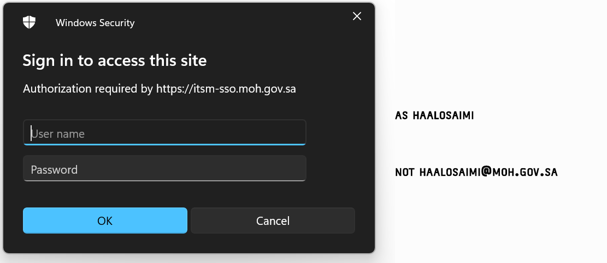
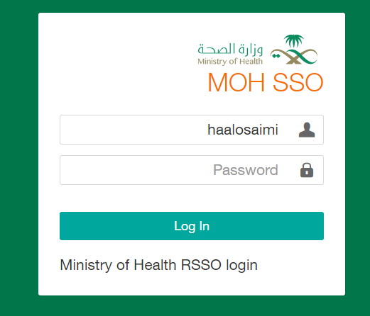
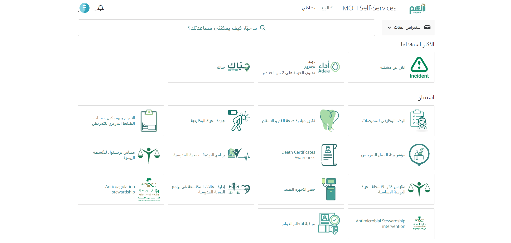
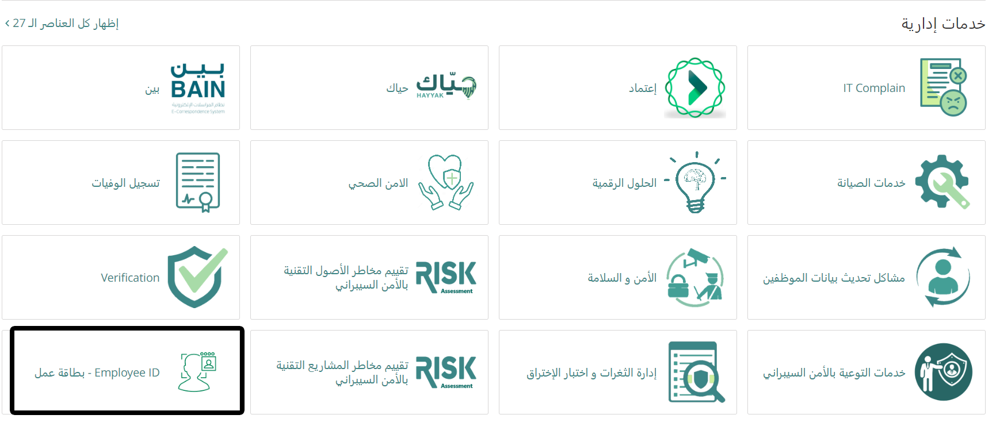
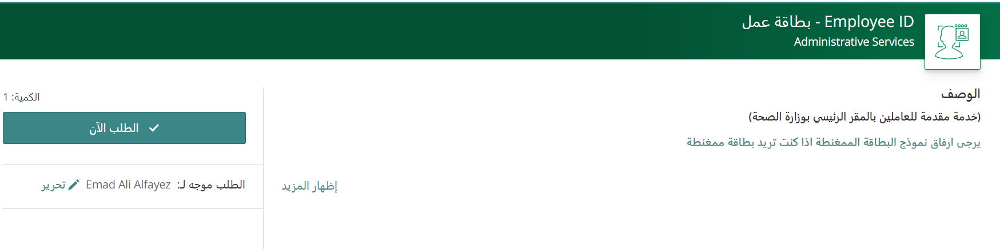
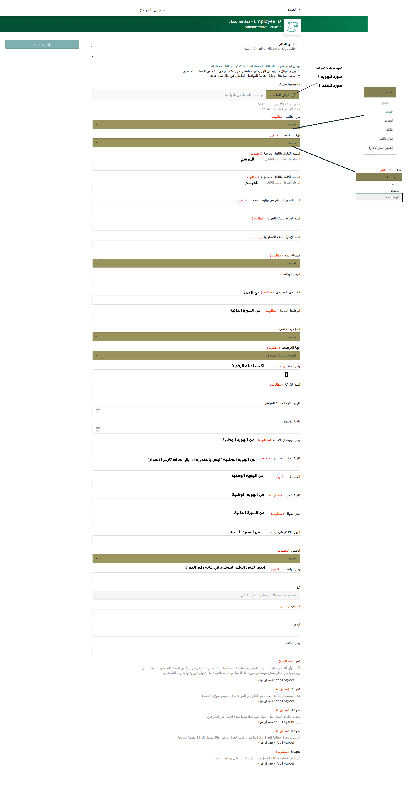
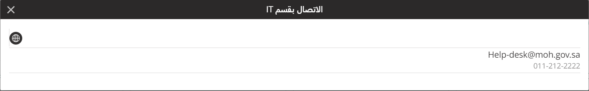

# Onboarding doc 

## ID
in order to login to shahm , you will need to do the following thing first
1. Connect to MOH netowrk , you cant access shahm in your local network .
2. You need a MOH email . 
3. prepere employee id , CV , Bloodtype and contract .

### Login to shahm
Go to the following page : [Shahm](https://itsm.moh.gov.sa/)

Type your personal email and password "Note the email will be writing with out "@moh.gov.sa" as shown below:

### Shahm home page
After loging in , your will be at the home page .

go down to "خدمات اداريه " and click on "Employee ID"

click on "اطلب الان"

### Shahm ID page explained

### Shahm Troubleshooting/ support
as menthied before *You will need a MOH email and Connect to MOH netowrk* you cant access shahm without these two .
for support you can contact them at the email or phone below: 

## Car Sticker 

### Permanent
Download the file in : [تصريح ستيكر دائم](https://drive.google.com/file/d/18tIJvSwBJt-Hin6_3D2Zcqn_EXdDcNco/view?usp=sharing)
After Filling the form , Send it to the following email with Vehicle Registeration as pdf :
P-Permits@moh.gov.sa

### Temporary
Download the file in : [تصريح مؤقت](https://drive.google.com/file/d/18tIJvSwBJt-Hin6_3D2Zcqn_EXdDcNco/view?usp=sharing)
After Filling the form , Send it to the following email with Vehicle Registeration as pdf :
P-Permits@moh.gov.sa

## Laptop 

Download the file in : [محضر نقل](https://drive.google.com/file/d/1UYcah5zE2bt5DBbibrNKnIiLNhf9i97U/view?usp=sharing)

## entering shipment in and out the building 

